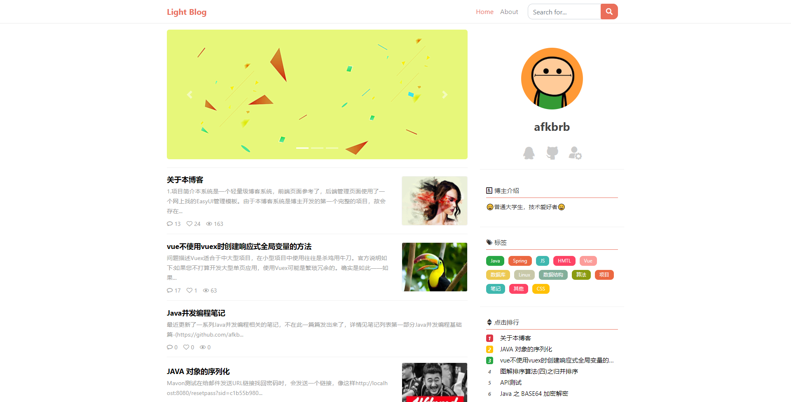

# light-blog-back
## 简介

Light Blog是一个前后端分离的轻量级个人博客系统，基于本人以前的同名项目[LightBlog](https://github.com/afkbrb/LightBlog)。

本博客系统由后台服务器系统(light-blog-back)、后台管理系统(light-blog-admin)、前端系统(light-blog-front)三个子系统组成。其中，后台服务系统基于SpringBoot，后台管理系统和前端系统均基于Vue。每个子系统的详细介绍可参看相应的Github地址。

本后台服务系统使用了[spring-boot-api-project-seed](https://github.com/lihengming/spring-boot-api-project-seed)作为基本骨架。

## 技术栈

SpringBoot + Maven + Mybatis + PageHelper + MySQL

## 传送门

- [后台服务系统(light-blog-back)](https://github.com/afkbrb/light-blog-back)
- [后台管理系统(light-blog-admin)](https://github.com/afkbrb/light-blog-admin)
- [前端系统(light-blog-front)](https://github.com/afkbrb/light-blog-front)
- [API](https://www.showdoc.cc/lightblog?page_id=2428180430024349)

## 截图

### 前台

### 后台

## 构建和运行

1. `git clone git@github.com:afkbrb/light-blog-back.git`
2. `cd light-blog-back`
3. 建一个名为**lightblog**的数据库，将light-blog.sql导入并修改/src/main/resources/application.properties中的jdbc配置（数据库名称、用户名、密码）。
4. 解压upload.zip到E:/盘根目录下，如果不是该目录，需要修改/src/main/resources/application.properties
   中的**blog.upload.dir=E:/upload**配置项。
5. 当有用户评论时，系统默认**不会**发送邮件通知管理员，相关配置也在/src/main/resources/application.properties，你可以通过设置**blog.mail.on=true**来开启邮件服务，同时请记得配置好blog.mail.*形式的配置项，尤其是要去**申请邮箱服务的授权码**（可参考[这篇文章](https://service.mail.qq.com/cgi-bin/help?subtype=1&&no=1001256&&id=28)）。
6. `mvn install `
7. `cd target`
8. `java -jar ./light-blog-back-0.0.1-SNAPSHOT.jar` 默认情况下程序运行在[http://localhost/api](http://localhost/api)

> 注意：后台系统默认host为localhost，post为80，context-path为/api，所以light-blog.sql中的图片路径均为[http://localhost/api/upload/path/to/image]()形式，如果你修改了上述三项中的任意一项，建议使用查找替换的方法将light-blog.sql中的[http://localhost/api]()替换成相应的形式。

## BlahBlah

如果本项目对您学习Vue或SpringBoot等有所帮助的话，请帮忙点颗⭐哦😁！

如果您对本项目有什么意见或建议，也欢迎批评指正。
